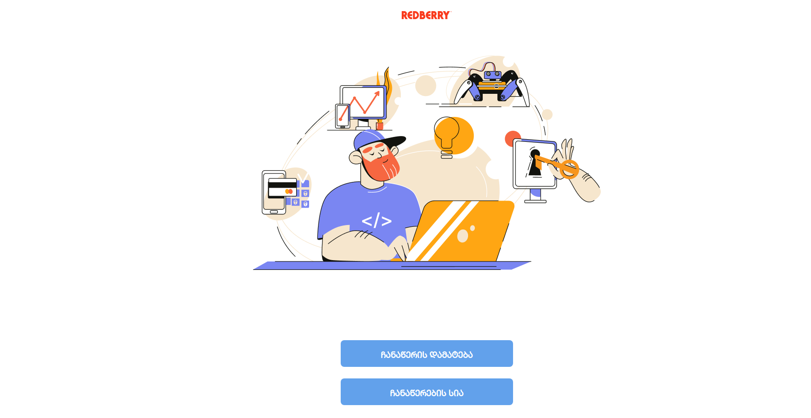

<div style="display:flex; align-items: center">
  <h1 style="position:relative; top: -6px" >Redberry laptop</h1>
</div>

---



Redberry Laptop App is a platform where employee can fill out a big form where is two segment of form. First is about employee and second about his/her laptop. Finally, data which got by form, stored and we can see it in records list. unfortunetely, API is dismissed and site can't work in the correct way.

#

### Table of Contents

- [Prerequisites](#prerequisites)
- [Tech Stack](#tech-stack)
- [Getting Started](#getting-started)

### Prerequisites

-  _Node JS @12.X and up_
-  _Yarn @1.X and up_
-  _npm @6 and up_

#

### Tech Stack

-  [React @18.2.0](https://reactjs.org) - front-end framework
-  [CSS module](https://tailwindcss.com/) - CSS

#

### Getting Started

1\. First of all you need to clone repository from github:

```sh
git clone https://github.com/datomaluta/redberry-laptop.git
```

2\. Next, go to app directory with this command

```sh
cd redberry-laptop
```

3\. Next step requires install all the dependencies.

```sh
npm install
```

or

```sh
yarn
```

4\. after that you can run application from terminal:

```sh
npm run dev
```

#
